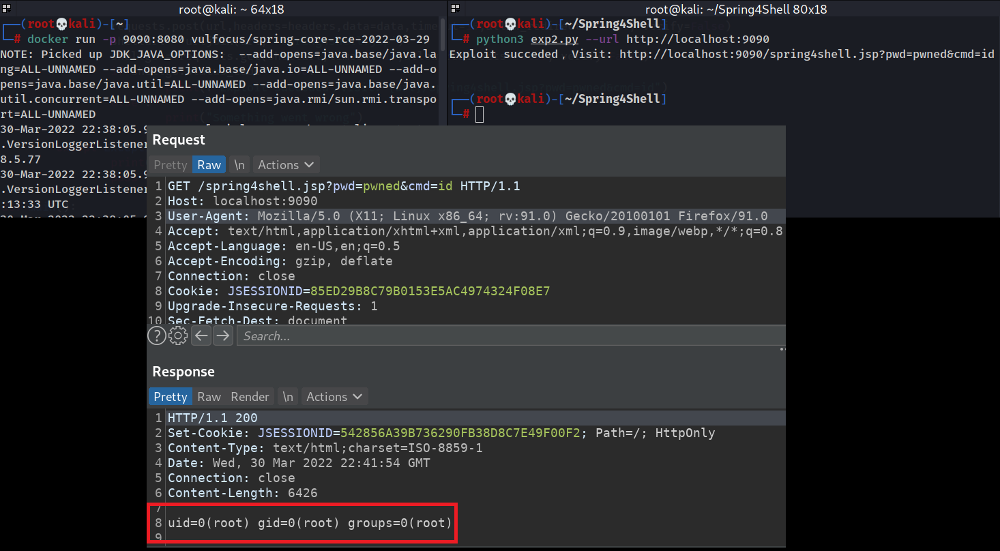

# Spring4Shell
### spring4shell POC

## Vulnerable docker 
```sh
docker run -p 9090:8080 vulfocus/spring-core-rce-2022-03-29
```

## Running the exploit
```sh
python3 exploit.py --url http://localhost:9090
```




based on the POC found here : https://github.com/craig/SpringCore0day/blob/main/exp.py 

and the  docker found here: https://hub.docker.com/r/vulfocus/spring-core-rce-2022-03-29
